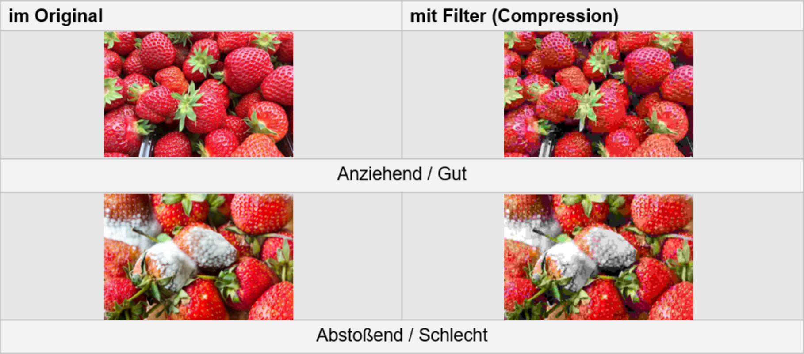
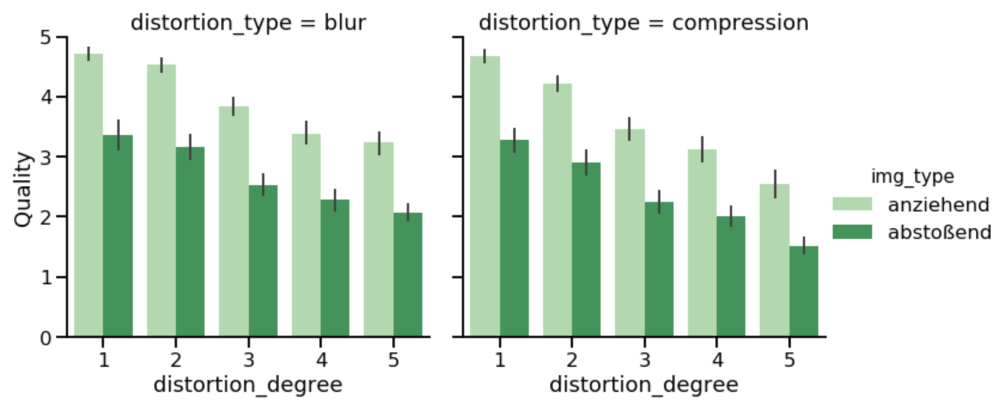
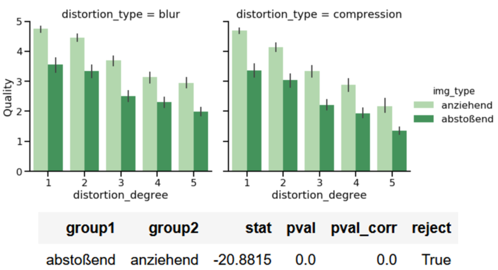

# Welchen Einfluss hat ein anziehendes Bild auf die Wahrnehmung von Bildqualität?

<hr style="border:1px solid black"> </hr>

# Fung-Joen Lam, Isa Wasswa Musisi, Erik Wegener

<hr style="border:1px solid black"> </hr>

# Seminar: Visuelle Wahrnehmung beim Menschen und Bildqualität - WiSe 2020/21

# 1. Einleitung

<hr style="border:1px solid black"> </hr>

## Das Abgebildete Motiv eines Bildes, kann sich spürbar auf den Beobachter auswirken.
Unsere Forschungsfrage war, ob die Auswirkung auch die Wahrnehmung der Bildqualität beinhaltet.
Um die Frage zu testen, haben wir 2 Arten von Motiven ausgesucht, die jeweils eine abstoßende oder anziehende Wirkung auf den Beobachter haben sollten.
Diese haben wir dann auf verschiedene Stufen verzerrt (Blur, Compression) und den Versuchspersonen in Rahmen eines Rating-experiment vorgeführt.
Wir haben die folgenden Hypothesen getestet: 
Beim anziehendem Bild vermindert sich die Auswirkung der Verzerrung, auf die empfundene Bildqualität.


## 2. Experimentelles Design

<hr style="border:1px solid black"> </hr>

## Wir haben 2 Durchläufe, beim ersten Durchlauf, sollte der Beobachter die Bildqualität bewerten von einer Skala von 1 (sehr schlecht) - 5 (sehr gut).
Beim 2 Durchlauf bewertet der Beobachter das Bildmotiv von einer Skala 1 (abstoßend) – 5 (anziehend)
In unseren Versuchsbedingungen nutzen wir keine Bildpaare, sondern nur Einzelbilder ohne Referenzbild.
Wir haben 15 Probanden für dieses Experiment gefragt und insgesamt 22 Motive ausgewählt, davon waren 11 Motive anziehend und 11 Motive abstoßend.
Hierbei waren unsere Unabhängigen Variable, das Bildmotiv (abstoßend- anziehend), Verzerrungsgrad (1 wenig - 5 stark) und Verzerrungstyp (Blur, Compression).
Unsere Abhängige Variable war die Bildqualität (1 schlecht- 5 exzellent).


### Imports


```python
import numpy as np
import matplotlib.pyplot as plt
from os import walk

# Pillow library, to manipulate images
from PIL import Image, ImageFilter

import pandas as pd    # module to work with data in DataFrames.
import seaborn as sns

import scipy
from statsmodels.stats.multicomp import MultiComparison
```

## Distortion Functions

### Noise


```python
def noise(im_n, name, degree, count):
    
    im = np.array(im_n)
    im_d = np.copy(im)
    Nx = im.shape[0]
    Ny = im.shape[1]
    m = int(Nx*Ny*degree)

    # take a random sample (without replacement) of size NxN out of number of pixels  
    spots_x = np.random.choice(range(Nx), m)
    spots_y = np.random.choice(range(Ny), m)

    # for each pixel we want to change
    for i in range(m):
        # we randomly assign either 0 (black) or 255 (white)
        im_d[spots_x[i], spots_y[i]] = np.random.randint(2)*255

    index = name.find('.')
    f = name[:index] + '_noise_' + str(degree) + name[index:]
    Image.fromarray(im_d).save('images/noise/'+ f, 'jpeg')
    return im_d
```

### Blur


```python
def blur(im, name, degree):

    global blu
    img = im.filter(ImageFilter.GaussianBlur(degree))
    im_b = np.array(img)
    index = name.find('.')
    f = name[:index] + '_blur_' + str(blu) + name[index:]
    Image.fromarray(im_b).save('images/blur/'+ f, 'jpeg')
    blu = blu + 1
    if blu > 5:
        blu = 1
    
    return im_b
```

### Compression


```python
def compress(im, name, degree, count):
    global com
    im_b = np.array(im)
    
    index = name.find('.')
    f = name[:index] + '_compression_' + str(count) + name[index:]
    Image.fromarray(im_b).save('images/compression/'+ f, 'jpeg', quality=degree)
    im_g = Image.open('images/compression/'+ f)#.convert('L')
    im_g = np.array(im_g)
    return im_g
```

# Reading and Processing Images


```python
pathList = ['images/gut/', 'images/schlecht/']
noises = [0, 0.1,0.2,0.3,0.4, 0.5]
compressions = [1,5,7,14,40]
blurs = [4,3,2,1,0.2]

def process(paths):
    
    for path in paths:
        _, _, filenames = next(walk(path), (None, None, []))

        for file in filenames:
            im_orig = Image.open(path + file)#.convert('L')

            for i in range(len(blurs)):
                blur(im_orig, file, blurs[i], i)
            for j in range(len(compressions)):
                compress(im_orig, file, compressions[j], j)
            for n in range(len(noises)):
                noise(im_orig, file, noise[n], n)
    print('done')
    

process(pathList)
```

# Sample Images



### some descriptions

# 3. Ergebnisse

<hr style="border:1px solid black"> </hr>

## Bla Bla

## CSV Dateien einlesen


```python
paths = ['results/', 'results/erik/', 'results/fung/']
df = None
df2 = None
count = 1
count2 = 1
for path in paths:
    
    _, _, filenames = next(walk(path), (None, None, []))
    for f in filenames:
        
        dft = None
        countt = 1
        if 'phase_1' in f:
            dft = pd.read_csv(path+f)
            dft['observer'] = 'Person '+str(count)
            count += 1
            if dft is None:
                df = dft
            else:
                df = pd.concat((df, dft)) 
        elif 'phase_2' in f:
            dft = pd.read_csv(path+f)
            dft['observer'] = 'Person '+str(count2)
            count2 += 1
            if dft is None:
                df2 = dft
            else:
                df2 = pd.concat((df2, dft)) 
        else:
            continue
        
```

## Daten vorbereiten


```python
dfo = df.copy()
df['img_type'] = df['img_type'].replace(0, 'abstoßend')
df['img_type'] = df['img_type'].replace(1, 'anziehend')
df['distortion_type'] = df['distortion_type'].replace(0, 'blur')
df['distortion_type'] = df['distortion_type'].replace(1, 'compression')
a = len(df['distortion_degree'].unique())
for i in range(int(a/2)):
    df['distortion_degree'] = df['distortion_degree'].replace(i+1, 'placeholder')
    df['distortion_degree'] = df['distortion_degree'].replace(a-i, i+1)
    df['distortion_degree'] = df['distortion_degree'].replace('placeholder',a-i)
dfo = df.copy()
ex = {}
for index, da in df2.iterrows():
    if da.response == 2 or (da.img_type == 0 and da.response != 1) or (da.img_type == 1 and da.response != 3):
        #print(da)
        #print(da.observer in ex)
        
        if da.observer not in ex:
            ex[da.observer] = [da.img_num]
        else: 
            ex[da.observer].append(da.img_num)

for key, value in ex.items():
    value.sort()
    for num in value:
        dfo = dfo[(dfo.observer != key) | (dfo.img_num != num)]
```

## Zusammenfassung aller Versuchspersonen



## Zusammenfassung nach Korrektur



# 4. Diskussion

<hr style="border:1px solid black"> </hr>

### Es ergab sich, dass ein signifikanter Unterschied zwischen einem anziehenden und abstoßenden Bild besteht. Des Weiteren konnte eine positive Korrelation zwischen Wahrnehmung des Bildmotivs und Wahrnehmung der Bildqualität beobachtet werden. Diese Ergebnisse bestetigen unsere Erwartungen, da sie mit unserer Hypothese übereinstimmen.

## Mögliche Probleme


```python

```
